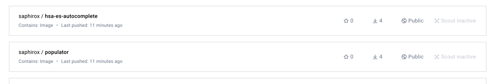

## CI CD (Github actions)

## Description
- Set up github action to build related docker containers
- Run action
- Check that artifacts published
- run locally application

1. Set up github action

2. Run action   

3. Check that artifacts published 

4. Run published artifacts
 